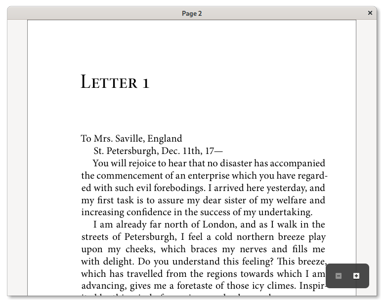

<a href="https://hosted.weblate.org/engage/pdf-slicer/?utm_source=widget">

</a>

# PDF Slicer

This is a simple application for extracting and rotating pages of a PDF document,
with undo/redo support.




# Installing

# Linux

You can install PDF Slicer using Flatpak. [Get it from Flathub](https://flathub.org/apps/details/com.github.junrrein.PDFSlicer).

# Windows

You can download the installer from the [Releases page](https://github.com/junrrein/pdfslicer/releases/latest).

# Building

## Fedora

1. Install dependencies

```bash
sudo dnf install gtkmm30-devel poppler-glib-devel cairomm-devel libaesgm-devel uuid-devel intltool gettext
```

2. Check out a copy of the source code

```bash
git clone --recursive https://github.com/junrrein/pdfslicer.git
```

3. Build the application

```bash
cd ..
mkdir build-pdfslicer
cd build-pdfslicer
cmake ../pdfslicer/ -DCMAKE_BUILD_TYPE=Release -DUSE_BUNDLED=FALSE
make
```

4. Install

```bash
sudo make install
```

5. Uninstall

```bash
sudo xargs rm < install_manifest.txt
```

## Flatpak

```bash
flatpak remote-add --from gnome https://sdk.gnome.org/gnome.flatpakrepo
flatpak install gnome org.gnome.Platform//3.28
flatpak install gnome org.gnome.Sdk//3.28
wget https://raw.githubusercontent.com/junrrein/pdfslicer/master/com.github.junrrein.PDFSlicer.json
flatpak-builder --repo=pdfslicer-repo pdfslicer com.github.junrrein.PDFSlicer.json --force-clean
flatpak --user remote-add --no-gpg-verify --if-not-exists pdfslicer-repo pdfslicer-repo
flatpak --user install pdfslicer-repo com.github.junrrein.PDFSlicer
```

### Uninstall

```bash
flatpak --user uninstall com.github.junrrein.PDFSlicer
flatpak --user remote-delete pdfslicer-repo
rm -rf pdfslicer/ pdfslicer-repo/
```

## Windows cross-compilation (Fedora only)

```bash
sudo dnf install mingw64-gcc-c++ mingw64-gtkmm30 mingw64-poppler-glib mingw64-librsvg2
git clone --recursive https://github.com/junrrein/pdfslicer.git
mkdir build-pdfslicer
cd build-pdfslicer
mingw64-cmake ../pdfslicer -DCMAKE_BUILD_TYPE=Release -DUSE_BUNDLED=OFF
make package
```

This proccess will generate the installer inside the `build-pdfslicer` directory with name `PDF Slicer.exe`.

# License

PDF Slicer can be used under the terms of the GNU GPL 3.0 license,
or, at your option, any later version.
A copy can be found at the LICENSE file.

The application icon was made by [Freepik](http://www.freepik.com) from [flaticon.com](https://www.flaticon.com). It's licensed under the [Creative Commons BY 3.0](http://creativecommons.org/licenses/by/3.0/) license.

A number of third-party libraries are distributed as part of this source
code repository. They are enumerated at the LICENSE-THIRD-PARTY file,
along with details about the license they were relased under.
